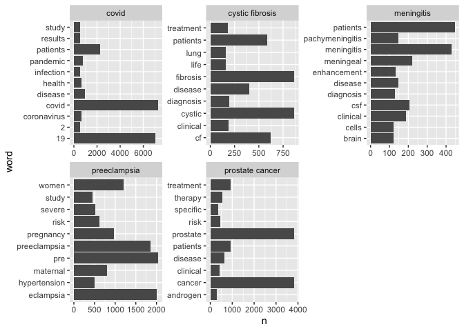
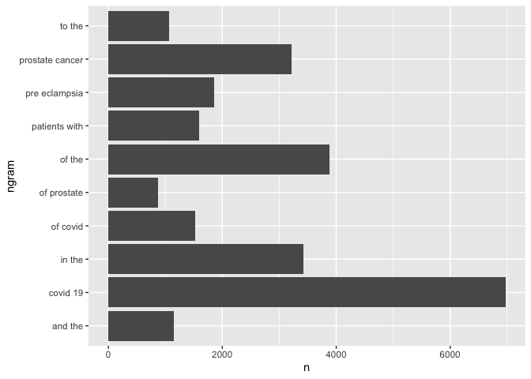
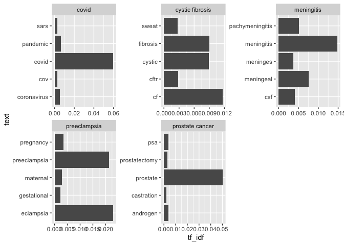

Assignment 03 - Web Scraping and Text Mining
================
Xiaoyu Zhu
11/5/2021

``` r
knitr::opts_chunk$set(include  = TRUE, echo=FALSE)
library(xml2)
library(stringr)
library(httr)
library(tidyverse)
```

    ## ── Attaching packages ─────────────────────────────────────── tidyverse 1.3.1 ──

    ## ✓ ggplot2 3.3.5     ✓ purrr   0.3.4
    ## ✓ tibble  3.1.5     ✓ dplyr   1.0.7
    ## ✓ tidyr   1.1.3     ✓ forcats 0.5.1
    ## ✓ readr   2.0.1

    ## ── Conflicts ────────────────────────────────────────── tidyverse_conflicts() ──
    ## x dplyr::filter() masks stats::filter()
    ## x dplyr::lag()    masks stats::lag()

``` r
library(dplyr)
library(ggplot2)
library(forcats)
library(tidytext)
```

# APIs

## Using the NCBI API, look for papers that show up under the term “sars-cov-2 trial vaccine.” Look for the data in the pubmed database, and then retrieve the details of the paper as shown in lab 7. How many papers were you able to find?

    ## [1] "2,339"

I am able to find <span class="value">2,339</span> papers.

## Using the list of pubmed ids you retrieved, download each papers’ details using the query parameter rettype = abstract. If you get more than 250 ids, just keep the first 250.

## As we did in lab 7. Create a dataset containing the following:

1 Pubmed ID number, 2 Title of the paper, 3 Name of the journal where it
was published, 4 Publication date, and 5 Abstract of the paper (if any).

-   There are 61 papers missing abstracts.

**Only the first five data records are shown**

| PubMedID | Title                                                                                                                                                                              | Journal                                     | Date        | Abstracts                                                                                                                                                                                                                                                                                                                                                                                                                                                                                                                                                                                                                                                                                                                                                                                                                                                                                                                                                                                                                                                                                                                                                                                                                                                                                                                                                                                                                                                                                                                                                                                                                                                                                                                                                                                                                                                                                                                                                                                                                                                                                                                                                                                                                                                                                                                                |
|:---------|:-----------------------------------------------------------------------------------------------------------------------------------------------------------------------------------|:--------------------------------------------|:------------|:-----------------------------------------------------------------------------------------------------------------------------------------------------------------------------------------------------------------------------------------------------------------------------------------------------------------------------------------------------------------------------------------------------------------------------------------------------------------------------------------------------------------------------------------------------------------------------------------------------------------------------------------------------------------------------------------------------------------------------------------------------------------------------------------------------------------------------------------------------------------------------------------------------------------------------------------------------------------------------------------------------------------------------------------------------------------------------------------------------------------------------------------------------------------------------------------------------------------------------------------------------------------------------------------------------------------------------------------------------------------------------------------------------------------------------------------------------------------------------------------------------------------------------------------------------------------------------------------------------------------------------------------------------------------------------------------------------------------------------------------------------------------------------------------------------------------------------------------------------------------------------------------------------------------------------------------------------------------------------------------------------------------------------------------------------------------------------------------------------------------------------------------------------------------------------------------------------------------------------------------------------------------------------------------------------------------------------------------|
| 34735795 | Immunogenicity of standard and extended dosing intervals of BNT162b2 mRNA vaccine.                                                                                                 | Cell                                        | 2021 Oct 16 | Extension of the interval between vaccine doses for the BNT162b2 mRNA vaccine was introduced in the United Kingdom to accelerate population coverage with a single dose. At this time, trial data were lacking, and we addressed this in a study of United Kingdom healthcare workers. The first vaccine dose induced protection from infection from the circulating alpha (B.1.1.7) variant over several weeks. In a substudy of 589 individuals, we show that this single dose induces severe acute respiratory syndrome coronavirus 2 (SARS-CoV-2) neutralizing antibody (NAb) responses and a sustained B and T cell response to the spike protein. NAb levels were higher after the extended dosing interval (6-14 weeks) compared with the conventional 3- to 4-week regimen, accompanied by enrichment of CD4+ T cells expressing interleukin-2 (IL-2). Prior SARS-CoV-2 infection amplified and accelerated the response. These data on dynamic cellular and humoral responses indicate that extension of the dosing interval is an effective immunogenic protocol.                                                                                                                                                                                                                                                                                                                                                                                                                                                                                                                                                                                                                                                                                                                                                                                                                                                                                                                                                                                                                                                                                                                                                                                                                                                              |
| 34735426 | Effectiveness of 2-Dose Vaccination with mRNA COVID-19 Vaccines Against COVID-19-Associated Hospitalizations Among Immunocompromised Adults - Nine States, January-September 2021. | MMWR. Morbidity and mortality weekly report | 2021 Nov 05 | Immunocompromised persons, defined as those with suppressed humoral or cellular immunity resulting from health conditions or medications, account for approximately 3% of the U.S. adult population (1). Immunocompromised adults are at increased risk for severe COVID-19 outcomes (2) and might not acquire the same level of protection from COVID-19 mRNA vaccines as do immunocompetent adults (3,4). To evaluate vaccine effectiveness (VE) among immunocompromised adults, data from the VISION Network\* on hospitalizations among persons aged ≥18 years with COVID-19-like illness from 187 hospitals in nine states during January 17-September 5, 2021 were analyzed. Using selected discharge diagnoses,† VE against COVID-19-associated hospitalization conferred by completing a 2-dose series of an mRNA COVID-19 vaccine ≥14 days before the index hospitalization date§ (i.e., being fully vaccinated) was evaluated using a test-negative design comparing 20,101 immunocompromised adults (10,564 \[53%\] of whom were fully vaccinated) and 69,116 immunocompetent adults (29,456 \[43%\] of whom were fully vaccinated). VE of 2 doses of mRNA COVID-19 vaccine against COVID-19-associated hospitalization was lower among immunocompromised patients (77%; 95% confidence interval \[CI\] = 74%-80%) than among immunocompetent patients (90%; 95% CI = 89%-91%). This difference persisted irrespective of mRNA vaccine product, age group, and timing of hospitalization relative to SARS-CoV-2 (the virus that causes COVID-19) B.1.617.2 (Delta) variant predominance in the state of hospitalization. VE varied across immunocompromising condition subgroups, ranging from 59% (organ or stem cell transplant recipients) to 81% (persons with a rheumatologic or inflammatory disorder). Immunocompromised persons benefit from mRNA COVID-19 vaccination but are less protected from severe COVID-19 outcomes than are immunocompetent persons, and VE varies among immunocompromised subgroups. Immunocompromised persons receiving mRNA COVID-19 vaccines should receive 3 doses and a booster, consistent with CDC recommendations (5), practice nonpharmaceutical interventions, and, if infected, be monitored closely and considered early for proven therapies that can prevent severe outcomes. |
| 34729549 | Adverse events of active and placebo groups in SARS-CoV-2 vaccine randomized trials: A systematic review.                                                                          | The Lancet regional health. Europe          | 2021 Oct 28 | NA                                                                                                                                                                                                                                                                                                                                                                                                                                                                                                                                                                                                                                                                                                                                                                                                                                                                                                                                                                                                                                                                                                                                                                                                                                                                                                                                                                                                                                                                                                                                                                                                                                                                                                                                                                                                                                                                                                                                                                                                                                                                                                                                                                                                                                                                                                                                       |
| 34726743 | Analysis of the Effectiveness of the Ad26.COV2.S Adenoviral Vector Vaccine for Preventing COVID-19.                                                                                | JAMA network open                           | 2021 11 01  | NA                                                                                                                                                                                                                                                                                                                                                                                                                                                                                                                                                                                                                                                                                                                                                                                                                                                                                                                                                                                                                                                                                                                                                                                                                                                                                                                                                                                                                                                                                                                                                                                                                                                                                                                                                                                                                                                                                                                                                                                                                                                                                                                                                                                                                                                                                                                                       |
| 34715931 | Lessons from Israel’s COVID-19 Green Pass program.                                                                                                                                 | Israel journal of health policy research    | 2021 10 29  | As of the beginning of March 2021, Israeli law requires the presentation of a Green Pass as a precondition for entering certain businesses and public spheres. Entitlement for a Green Pass is granted to Israelis who have been vaccinated with two doses of COVID-19 vaccine, who have recovered from COVID-19, or who are participating in a clinical trial for vaccine development in Israel. The Green Pass is essential for retaining immune individuals’ freedom of movement and for promoting the public interest in reopening the economic, educational, and cultural spheres of activity. Nonetheless, and as the Green Pass imposes restrictions on the movement of individuals who had not been vaccinated or who had not recovered, it is not consonant with solidarity and trust building. Implementing the Green Pass provision while advancing its effectiveness on the one hand, and safeguarding equality, proportionality, and fairness on the other hand may imbue this measure with ethical legitimacy despite involving a potential breach of trust and solidarity.                                                                                                                                                                                                                                                                                                                                                                                                                                                                                                                                                                                                                                                                                                                                                                                                                                                                                                                                                                                                                                                                                                                                                                                                                                                |

-   Check the first 5 papers and the dataset is successfully created.

# Text Mining

## A new dataset has been added to the data science data repository <https://github.com/USCbiostats/data-science-data/tree/master/03_pubmed>. The dataset contains 3241 abstracts from articles across 5 search terms. Your job is to analyse these abstracts to find interesting insights.

    ## Rows: 3241 Columns: 2

    ## ── Column specification ────────────────────────────────────────────────────────
    ## Delimiter: ","
    ## chr (2): abstract, term

    ## 
    ## ℹ Use `spec()` to retrieve the full column specification for this data.
    ## ℹ Specify the column types or set `show_col_types = FALSE` to quiet this message.

### 1 Tokenize the abstracts and count the number of each token. Do you see anything interesting? Does removing stop words change what tokens appear as the most frequent? What are the 5 most common tokens for each search term after removing stopwords?

    ## # A tibble: 10 × 2
    ##    token     n
    ##    <chr> <int>
    ##  1 the   28126
    ##  2 of    24760
    ##  3 and   19993
    ##  4 in    14653
    ##  5 to    10920
    ##  6 a      8245
    ##  7 with   8038
    ##  8 covid  7275
    ##  9 19     7080
    ## 10 is     5649

What we can see from the table is that if not removing stop words the 5
most common tokens is “the”, “of”,“and”,“in” and “to”.

<!-- --> When
removing stop words, the most common tokens are “covid”, “19”, “cancer”,
“prostate”, and “patients”. The finding is in line with expectations.

### 2 Tokenize the abstracts into bigrams. Find the 10 most common bigram and visualize them with ggplot2.

<!-- -->

### 3 Calculate the TF-IDF value for each word-search term combination. (here you want the search term to be the “document”) What are the 5 tokens from each search term with the highest TF-IDF value? How are the results different from the answers you got in question 1?

<!-- --> - Under the
term covid: covid and pandemic has the highest TF-IDF value, which
excludes 19, patients and disease(TF-IDF=0). - Under the term cystic
fibrosis: cf becomes the first term instead of fibrosis. - Under the
term meningitis: patients has a TF-IDF value at 0. - Under the term
preeclampsia: tokens like pre and woman are excluded(TF-IDF=0). - Under
the term prostate cancer: only prostate has TF-IDF value.

